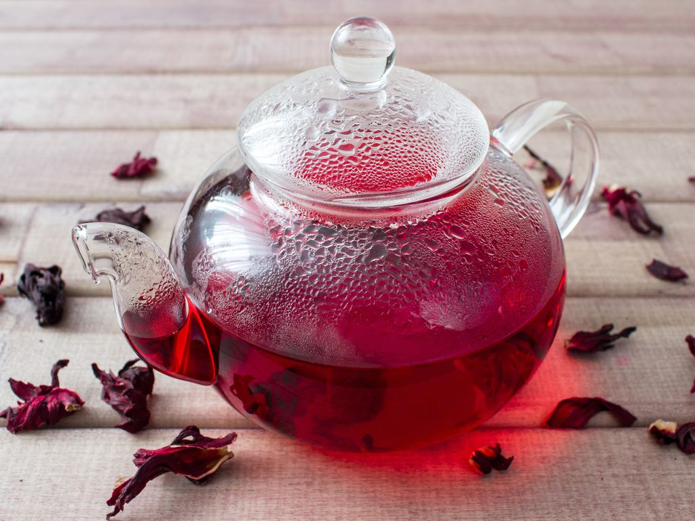

# bissap

| :timer_clock: Total Time |
|:-----------------------: |
| 5.00 hours |

## :salt: Ingredients

- 2 cups hibiscus flowers(bissap)
- 1 hibiscus
- 2.5 l water
- 1 hibiscus
- 100 g sugar
- 2 tbsp vanilla sugar
- 1 pinch nutmeg
- 2 tbsp orange water blossom

## :cooking: Cookware

## :pencil: Instructions

### Step 1

Rinse the hibiscus flowers(bissap).

### Step 2

Bring the hibiscus flowers(bissap) and water to a boil until the water is fully colored.

### Step 3

Let it cool and then remove the hibiscus flowers(bissap) (bissap) from the cooking juice.

### Step 4

Add the sugar, vanilla sugar, nutmeg, and orange water blossom to this juice and mix.

### Step 5

Chill for 5 hours and serve very cold.

## :link: Source

- <https://www.marmiton.org/recettes/recette_bissap-senegal_13796.aspx>
