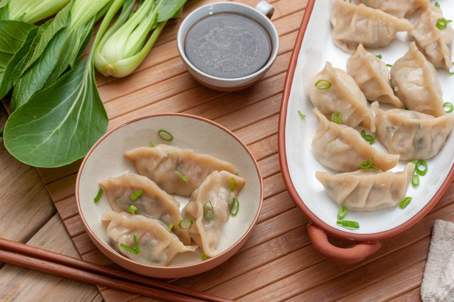

# potstickers

| :timer_clock: Total Time |
|:-----------------------: |
| 17 minutes |

## :salt: Ingredients

- 1 salted
- 0.75 cup Napa cabbage
- 1 cup Bok choy
- 1 cup Bok choy
- 2 tsp salt
- 0.5 lb ground pork
- 1 green onion
- 2 tsp minced ginger
- 1 egg
- 1 tbsp soy sauce
- 0.25 tsp hot chili oil
- 0.25 tsp sesame oil
- 1 potsticker wrapper
- 1 tbsp vegetable oil
- 0.5 cup hot water

## :cooking: Cookware

- 1 pot
- 1 medium bowl
- 1 heavy non-stick frying pan

## :pencil: Instructions

### Step 1

Gather the ingredients.

### Step 2

Bring a pot of salted water to a boil.

### Step 3

Blanch the Napa cabbage until it is tender but still crisp, 3 minutes.

### Step 4

First, prepare Bok choy by chopping it coarsely.

### Step 5

Cut the Bok choy or cabbage across into thin strips and mix with salt; set aside for 5 minutes.

### Step 6

In a medium bowl, combine the raw cabbage, ground pork, green onion, minced ginger, egg, soy sauce, hot chili oil or to
taste, and sesame oil. Mix to combine.

### Step 7

Lay a potsticker wrapper in front of you. Wet all the edges with water. Place a teaspoon of filling in the middle of the
wrapper. Fold the sides up to form a semicircle and then pinch the edges to seal. If desired, create pleats.

### Step 8

Continue with the rest of the potstickers wrappers until the filling is gone.

### Step 9

To cook, heat vegetable oil for frying, or as needed, in a heavy non-stick frying pan over medium-high heat.

### Step 10

Add 12 to 15 of the gyoza in a single layer and cook for 2 minutes, or until golden brown on the bottom.

### Step 11

Add hot water to the pan. Cover the dumplings and cook until the water is absorbed (7 minutes).

### Step 12

Repeat with the remainder of the dumplings.

## :link: Source

- <https://www.thespruceeats.com/panfried-pork-potstickers-694859>
