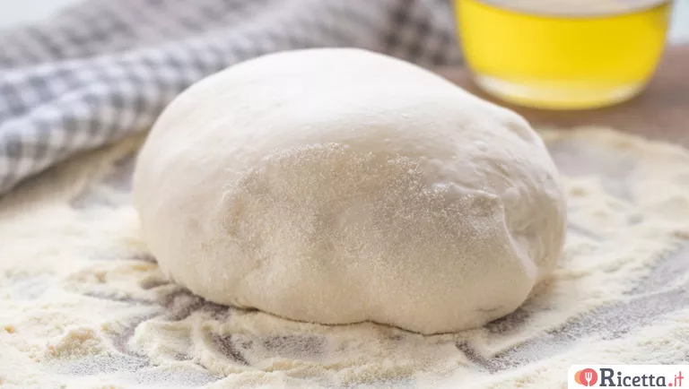

# pizza

| :timer_clock: Total Time |
|:-----------------------: |
| 4.75 hours |

## :salt: Ingredients

- 500 g 00 flour
- 7 g fresh brewer’s yeast
- 3 g dry brewer’s yeast
- 8 g salt
- 10 g extra virgin olive oil
- some semolina flour

## :cooking: Cookware

- 1 wooden spoon
- 1 oven
- 1 baking tray
- 1 cast iron baking tray

## :pencil: Instructions

### Step 1

Place the 00 flour , sifted, into a bowl and add the finely crumbled fresh brewer’s yeast or dry brewer’s yeast,
then mix using a wooden spoon.

### Step 2

Pour in the water a little at a time, continuing to stir so that the flour absorbs it and the yeast dissolves
completely. Add the salt and pour in the extra virgin olive oil, still mixing.

### Step 3

This type of roughly mixed dough is called 'no knead'.

### Step 4

Cover the bowl with a sheet of plastic wrap and let it rise for 30 minutes at room temperature.

### Step 5

Ideally, place it inside the oven using the 'oven off' function to maintain a steady temperature of 26-28°C.

### Step 6

If your oven doesn’t have this feature, you can wrap the bowl in a blanket and keep it in a draft-free spot.

### Step 7

After this time, transfer the dough to a work surface and fold it over itself, repeating the fold on all four sides.

### Step 8

Then, three times, stretch the dough toward yourself and fold it back.

### Step 9

Don’t worry if the dough feels quite sticky at first (you can sprinkle some flour on the surface to help).

### Step 10

Place the dough back into the bowl, cover with plastic wrap, and let it rise for another 20 minutes.

### Step 11

Repeat this folding and resting process two more times;

### Step 12

on the last round, before placing the dough back into the bowl, drizzle it with a little oil and finally let it rise at
room temperature for at least 3 hours.

### Step 13

Shaping the pizza into pans

### Step 14

Take the dough, place it on the work surface, and divide it into three equal portions.

### Step 15

This way, you will get pizzas of the right thickness: crispy on the outside, soft on the inside.

### Step 16

(Alternatively, the full amount of dough can be used for one rectangular baking tray.)

### Step 17

Cover the dough balls with a clean cloth or plastic wrap and let them rise again for another hour at room temperature.

### Step 18

Sprinkle some semolina flour on the surface and flatten each dough ball by pressing around the edges and the center with
your fingers.

### Step 19

Remove any excess semolina and transfer the dough to a baking tray (26-28 cm), greased with olive oil (it’s okay if
the dough doesn’t reach the edges yet).

### Step 20

Let it rest for about 30 minutes more, then stretch it out to the proper size with your hands.

### Step 21

Top with tomato sauce and your preferred ingredients.

### Step 22

Baking the pizza

### Step 23

Drizzle a little extra virgin olive oil over the top and bake in a preheated oven at the highest temperature (300°C)
for about 10 minutes,

### Step 24

or at 200°–220°C for 15 minutes.

### Step 25

You can recreate a stone-baked effect by heating a cast iron baking tray upside down (thicker trays work better) and
baking the pizza on top of a sheet of parchment paper.

## :link: Source

- <https://ricetta.it/impasto-pizza>
